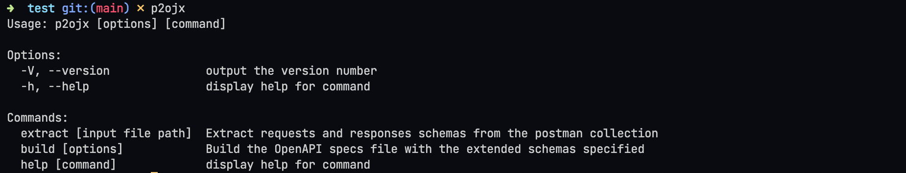
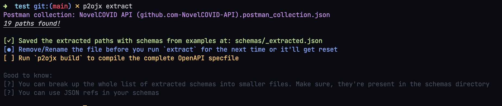
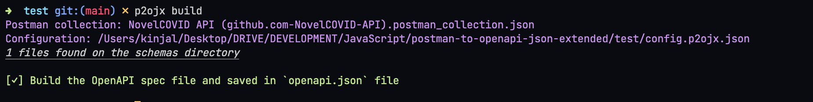

# postman-to-openapi-json-extended

> Convert Postman collection to OpenAPI Specs with extended components

Heavily inspired by and extending: [postman-to-openapi](https://github.com/joolfe/postman-to-openapi)

## Installation

```sh
npm install -g postman-to-openapi-json-extended
```

## Usage







### Extract

Extract request-response schemas paths from a exported postman collection. These schema paths are automatically populated by building a JSON schema from the examples provided (if any)

#### Steps:

- Run: `p2ojx extract` to extact from the `.postman_collection.json` file present in the working directory.

  > To explicitly pass a postman collection file, use the file path as the argument

- This will create a _`schemas`_ directory and all the extracted paths will be written in the _`schemas/_extracted.json`_ file

> The `_extracted.json` file is used for staging purposes. It is advised to rename this file before building the docs. Running the extrct command next time might over-write this file!

- Segregate the paths into multiple files for easier maintainance. Make sure all the files are in `.json` format and lie in the root of the `schemas` directory
- References can be used in the JSON schema files. While using references, make sure to treat the parent directory of the `schemas` file as root. Example:

```json
{
  "paths./health.get.responses.200.content.application/json.schema": {
    "$ref": "schemas/components/Health.json"
  }
}
```

### Build

Build the `openapi.json` file with all the data coming on from the postman collection file along with the extended schema

#### Steps

- Create a configuration file. Name it: `config.p2ojx.json`. For more info about configurations, read [here](https://joolfe.github.io/postman-to-openapi/#options)
- Run: `p2ojx build` to extact from the `.postman_collection.json` and `config.p2ojx.json` file present in the working directory.
  > - To explicitly pass a postman collection file, use `-p` to sepecify the path
  > - To pass a configuration file, use `-c` option
- This will create an `openapi.json` file in the present working directory

### Extensibility

Other components/schemas can be added in alongside the extracted request/response schemas. Each one should be point in the correct path and should be withon `.json` files in the `schemas` directory. Check out the _`schemasa/_extracted.json`_ to understand correct format
